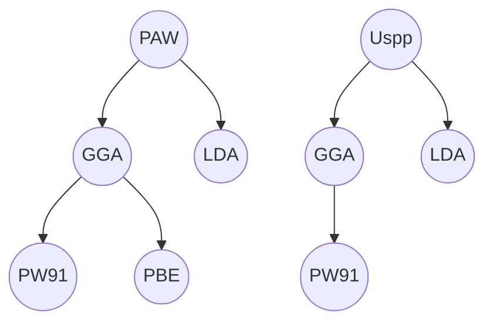

## INCAR
 SYSTEM =Oatom   # 氧符号,不是零!<!-- SYSTEM 后面是该计算的说明。你的这个任务算的是什么,目的是什么,体系是什么?等等,这写都可以随便写在里面。SYSTEM =Oatom和SYSTEM = ILOVE YOU和SYSTEM = VASP, 除了多出几个字符外,对计算没有什么影响 -->
ISMEAR = 0       # 是零,不是氧符号!  
SIGMA = 0.01     # 对于分子或者原子,用0.01
<!-- 2) ISMEAR这一项,目前需要记住的是:不同的值对应的是不同的展宽方法:
A) 对于半导体和绝缘体体系,ISMEAR的值取绝对不能大于0, 一般用0,
B)对所有体系,更加精确的时候用-5,
C)对于所有K点数目小于3的计算,不能用ISMEAR = -5。为什么呢?因为会出错。
D) K 点少,还是半导体或者绝缘体,那么只能用ISMEAR = 0。
E) 对于金属来说,ISMEAR的取值一般为1。
F) 保守地说,ISMEAR = 0(Gaussian Smearing) 可以满足大部分的体系(金属,导体,半导体,分子),
G) 在DOS能带计算中,使用ISMEAR= -5 用于获取精确的信息。 -->

## KPOINTS
K-POINTS # 第一行随便写都行
0 # 零,格子自动生成
Gamma # gamma点centered
1 1 1 # 1*1*1格子
0 0 0 # S1 S2 S3, 一般保持0 0 0 不变

## POSCAR
Oatom in a box #1
1.0 ! universalscaling parameters #2
8.0 0.0 0.0 ! lattice vector a(1) #3
0.0 8.0 0.0 ! lattice vector a(2) #4
0.0 0.0 8.0 ! lattice vector a(3) #5
O ! Oelement #6 notzero
1 ! number ofatoms #7
cart ! positionsincartesian coordinates #8
<!-- 这里,我们要计算氧原子能量,采取的模型是:把氧原子放到一个长宽高均为8.0 \AA (埃)的格子里,如果你要算其他原子或者分子,均采用这种模型,格子长宽高可以随便更改。
1) 第一行,同样随便写,但不能不写;
2) 第二行,一个Scalefactor,可以称为缩放系数,这里是1.0,如果写成2.0,则后面的三行中的数字以及xyz坐标都要除以2。一般来说,写成1.0即可,这样比较直观,清晰;
3) 第三到五行是格子在三个方向上的坐标信息;
4) 第六行是氧的元素符号,这里需要注意的是,
A) vasp4.xx版本里面没有这一行,最新的版本里面有;
B) 另外,O的符号和数字0容易混淆,一定要注意!
C) 在POSCAR里面该行没有的话也不会影响计算,VASP会读取POTCAR中的元素信息,但输出文件CONTCAR中会把该行自动添上;
D)第一个元素符号要顶格写,前面不要有空格,有可能会出错。
5) 第七行对应第六行元素原子的数目;
6) 第八行的cart,同KPOINTS的第三行,只认第一个字母,C或者c代表笛卡尔坐标, D或者d代表分数坐标系,两者的转换见参考阅读POSCAR2, 值得注意的是,VASP输出文件CONTCAR里面采用的是
分数坐标系,
两个坐标系的区别从第8行开始,前面的七行都保持完全一致。也就是说,如果想实现两个坐标系之间转换,我们只需改变第7行后面的部分即可;
7) 第9行是氧原子的坐标信息,这里我们把它放到了原点(0.0 0.0 0.0)的位置,大家也可以随便放一个位置,比如说(4.0 5.06.0 ), (1.1 2.5 6.5)等
由于周期性,不管你怎么放,相邻两个格子之间氧原子的距离都是一样的。 -->

## psedopotential 
PAW Ultrasoft 平级  
GGA + LDA  平级
GGA细分为PBE PW91等

<!-- use mermaid plot process -->

PAW和PBE是两码事，PAW相当于是赝势，虽然严格说它不是，PBE是泛函，是GGA的一种

<!-- - PAW，the general rule is to use PAW potentials wherever possible。 PAW赝势在创建过程中用很少的参数，对磁材料，过渡金属，镧系和锕系金属精确性好。
- 大部分元素的PAW赝势的创建要比超软赝势晚五年。
- 碱金属和碱土金属赝势的正确处理在离子化合物中相当重要。
- 赝势对于自旋极化计算会失败。因为赝势处理使得d波函数靠外，心电子和价电子重叠程度被人为降低，结果自旋增大因子就被低估。
- 对于化合物（不同原子半径的元素混合）来说，PAW赝势比超软赝势精确度高。
- 超软赝势有LDA和GGA两种
- PAW赝势有三个LDA,GGA(PW91,PBE) -->


vasp计算中用到的三种赝势：模守恒赝势，超软赝势，PAW赝势(按产生顺序)。


```tex
选择某个目录进去，我们还会发现对应每种元素往往还会有多种赝势存在。这是因为根据ENMAX的大小还可以分为 Ga,Ga_s（soft）,Ga_h，或者根据处理半芯态的不同还可以分为Ga,Ga_sv（s电子作为半芯态）,Ga_pv的不同。

对于化合物（不同原子半径的元素混合）来说，PAW赝势比超软赝势精确度高。

US型赝势所需截至能较小，计算速度快，PAW赝势截至能通常较大，而且考虑的电子数多，计算慢，但精确度高。

在做具体的计算之前，针对需要计算的性质选取不同的贋势做下测试。对于不同贋势得到的结果，关注其最终的能量差，而不是绝对能量。
```


 